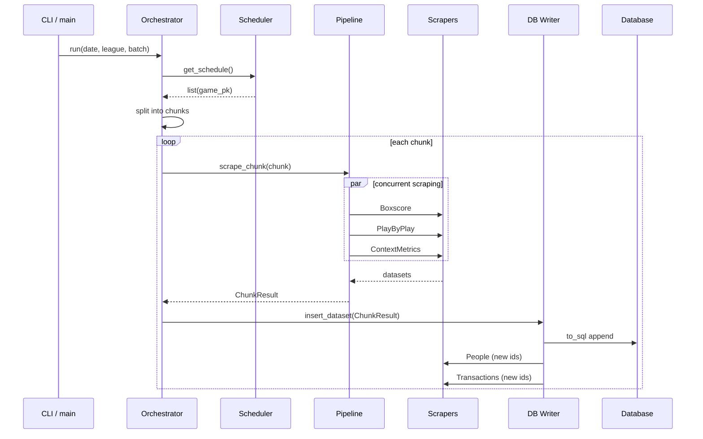

# MLB Stats API Scraper

## Overview

Este proyecto implementa un pipeline de extracción de datos (ETL) para la MLB Stats API. Su objetivo es recolectar, transformar y persistir datos de juegos de béisbol en una base de datos (SQLite u otra vía SQLAlchemy).

El sistema está diseñado con separación de responsabilidades, concurrencia y modularidad para facilitar mantenimiento y escalabilidad.

---

## Arquitectura

El sistema está dividido en tres capas principales:

### 1. Coordinación
Responsable del flujo general del programa.

- `orchestrator.py`: Punto de entrada y coordinación del pipeline
- `scheduler.py`: Obtiene los `game_pk` desde la API
- `pipeline.py`: Ejecuta scraping concurrente
- `db_writer.py`: Inserta datos en la base de datos

### 2. Scrapers
Encargados de consumir endpoints específicos y transformar respuestas en datasets.

- `Boxscore`
- `PlayByPlay`
- `ContextMetrics`
- `People`
- `Transactions`
- `BaseScraper` (clase abstracta base)

### 3. Infraestructura
Componentes reutilizables y configuración.

- `http_client`
- `endpoints`
- `config`
- `dataset`
- `extractor`
- `mappings`
- `table_names`
- `const/` (package modularizado)

---

## Flujo de ejecución

1. El usuario ejecuta:

```bash
python orchestrator.py --lg MLB --date 2024-04-01
```
---

2. Schedule

* scheduler.get_schedule()
* llama /schedule
* retorna game_pk

---

3. Orquestación

* orchestrator.run()
* divide en chunks (--batch)
* itera sobre juegos

---

4. Scraping concurrente

* `pipeline.scrape_chunk()`
* usa `ThreadPoolExecutor`
* cada `thread` ejecuta `scrapers` independientes

---

5. Scrapers

* `Boxscore`
* `PlayByPlay`
* `ContextMetrics`

---

6. Persistencia

* `db_writer.insert_dataset():`
* convierte a `pandas.DataFrame`
* ejecuta `to_sql(if_exists="append")`
* escribe ~19 tablas `staging`

---

7. Post-procesamiento

* People
* Transactions

--

## Diagrama de Flujo de ejecucion



## Diagrama de Directorioes

```mermaid

flowchart TD

ROOT[mlb-scraper]

ROOT --> ORCH[orchestrator.py]
ROOT --> SCH[scheduler.py]
ROOT --> PIPE[pipeline.py]
ROOT --> DBW[db_writer.py]
ROOT --> README[README.md]

ROOT --> SCR[ scrapers/ ]
SCR --> BASE[base_scraper.py]
SCR --> BOX[boxscore.py]
SCR --> PBP[play_by_play.py]
SCR --> CTX[context_metrics.py]
SCR --> PPL[people.py]
SCR --> TRX[transactions.py]

ROOT --> INF[ infra/ ]
INF --> HTTP[http_client.py]
INF --> END[endpoints.py]
INF --> CFG[config.py]
INF --> DATA[dataset.py]
INF --> EXT[extractor.py]
INF --> MAP[mappings.py]
INF --> TBL[table_names.py]

ROOT --> CONST[ const/ ]
CONST --> CINIT[__init__.py]
CONST --> CEND[endpoints.py]
CONST --> CCTX[context_metrics.py]
CONST --> CPPL[people.py]
CONST --> CTRX[transactions.py]
CONST --> CPBP[play_by_play.py]
CONST --> CBOX[boxscore.py]
```


